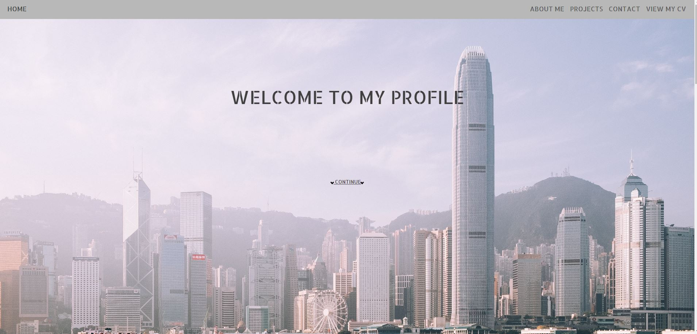
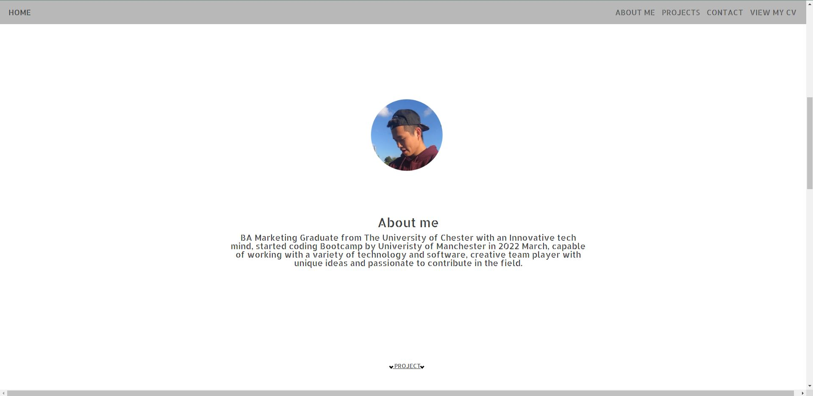
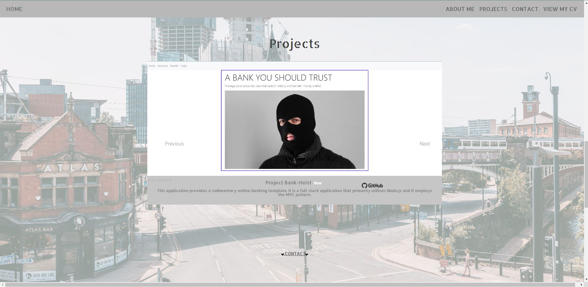
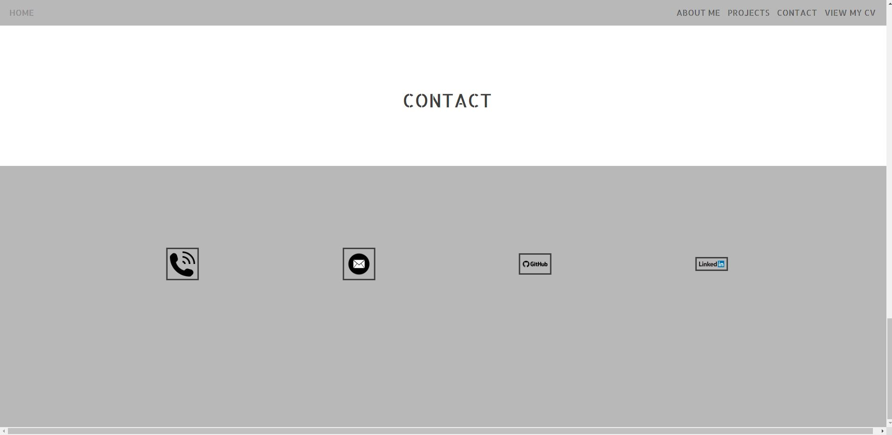

# Portfolio Page

## Description
This is a portfolio of myself.

## Table of Contents
- [Usage](#usage)
- [License](#license)

## Installation
here are the steps required to install
## Usage
GIVEN I need a portfolio for myself
WHEN I load the portfolio
THEN I am presented with the developer's name, a recent photo or avatar, and links to sections about them, their work, and how to contact them
WHEN I click one of the links in the navigation
THEN the UI scrolls to the corresponding section
WHEN I click on the link to the section about their work
THEN the UI scrolls to a section with titled images of the developer's applications
WHEN I am presented with the developer's application
THEN that application's image should be changing by itself
WHEN I click on the images of the applications
THEN I am taken to that deployed application
WHEN I click on the github logo by the image describtion box below
THEN i am taken to that application github page
WHEN I resize the page or view the site on various screens and devices
THEN I am presented with a responsive layout that adapts to my viewport

## Screenshot

## License
Licensed under the MIT License

## Questions

further question please visit https://github.com/shingchan95